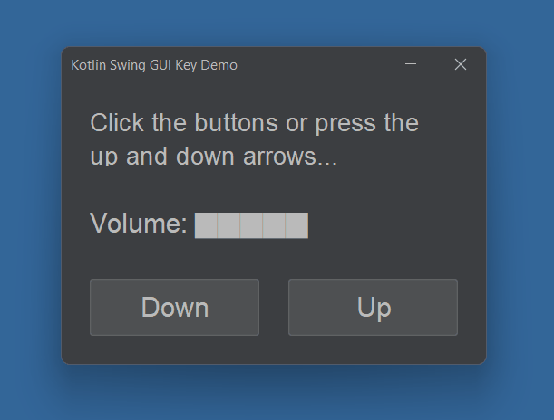

# Kotlin GUI Audio Demo

This is a demo showing how a Kotlin / Swing GUI app can detect and handle **global keypress events** (those not targeted at a specific UI control).

The trick is to always give the main window the **'focus'**. This means that any key press events are fed to the window, rather than any other UI elements.

To do do this:
1. Set **isFocusable** to false for all window controls such as buttons
2. In **updateView()**, we always **requestFocus()** for the main window

